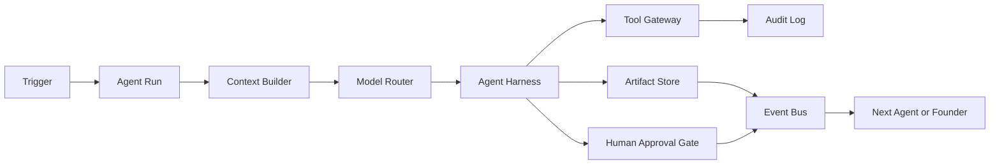

# Agent Harness Engineering

## What The Harness Is

The harness is the execution shell around each agent. It is responsible for turning a model from a clever text generator into a controllable worker.

It should own:

- What context the agent receives
- Which model is used
- Which tools the agent can call
- Which actions need human approval
- Where outputs are stored
- How runs are retried, replayed, and evaluated
- How one agent hands work to another agent

The key rule: agents do not talk directly to each other. They communicate through durable artifacts, tasks, events, and approvals.

The global Journey Orchestrator consumes those events and emits commands. The first implementation lives in `src/orchestrator/journeyStateMachine.ts`.

The State Supervisor watches the Journey Orchestrator for ambiguous or unmodeled situations. The first implementation lives in `src/orchestrator/stateSupervisor.ts`. It can ask 唐僧 to review, recommend a controlled event, or escalate to the founder, but it cannot directly mutate state.

## Trust Harness

The Trust Harness makes every artifact auditable before it moves to the next step. The first implementation lives in `src/harness/trustHarness.ts`.

Single-agent trust uses:

- Schema validity
- Durable source artifacts
- Source citations or source context
- Declared assumptions and uncertainty
- Tool-backed evidence

Collaborative trust adds:

- Upstream review from the previous step
- Downstream review from the next step
- 沙僧 evaluation
- 唐僧 decision
- Customer confirmation when available

Downstream review is mandatory as retrospective quality feedback. The receiver scores the upstream artifact after completing its own step, so the review is based on real execution experience rather than a pre-flight guess. This score updates the upstream agent's future confidence and routing weight; it does not stop the current workflow.

Examples:

- 猴哥 finishes implementation, then scores 八戒 output for implementability, input/output clarity, and scope control.
- 沙僧 finishes testing, then scores 猴哥 output for testability, reproducibility, and release risk.
- 白龙马 finishes customer feedback work, then scores 沙僧 output for customer clarity and adoption impact.

The first implementation lives in `DownstreamReview` inside `src/harness/trustHarness.ts`.

The runtime can turn this into an upstream confidence update with `upstreamConfidenceAdjustment()`. For example, if 八戒 has a historical confidence of `0.84` and 猴哥's post-implementation review averages `0.70`, a `0.20` downstream-review weight updates 八戒's future confidence to `0.81`. The current task still continues; the learning affects future planning, routing, and how much 唐僧 should inspect similar 八戒 outputs.

The important pattern is not majority vote. It is role-diverse verification. 八戒 can make a tasteful product proposal, 猴哥 can say whether it is implementable, 沙僧 can say whether it is testable, 白龙马 can say whether it creates customer value, and 唐僧 can decide whether it fits the mission.

Trust levels for current artifacts:

- `untrusted`: needs repair or TangSeng review before it is relied on
- `provisional`: can be discussed, but needs more evidence
- `trusted`: can move to the next internal step
- `release_ready`: can be used for customer-facing or release-sensitive work

## Core Runtime Shape



## Minimal Services

### 1. Orchestrator

Responsible for creating and advancing work.

Use Temporal, Inngest, LangGraph, or a custom queue-backed state machine.

Owns:

- Run scheduling
- Agent state transitions
- Retries
- Timeouts
- Dependency ordering
- Human approval pauses

### 2. Agent Harness

One generic harness implementation, configured differently per role.

Owns:

- System prompt
- Model route
- Input schema
- Output schema
- Tool policy
- Memory policy
- Approval policy
- Evaluation hooks

### 3. Context Builder

The context builder prevents context soup.

Inputs:

- Client profile
- Engagement brief
- Latest approved artifacts
- Relevant transcript slices
- Prior run summaries
- Open tasks
- Current trigger

Outputs:

- Short role-specific context packet
- Citations to source artifacts
- Excluded context list for auditability

### 4. Tool Gateway

Agents should never call raw tools directly.

The gateway should enforce:

- Role permissions
- Client workspace boundaries
- Rate limits
- Confirmation requirements
- Logging
- Redaction
- Dry-run support

### 5. Artifact Store

Every useful output becomes an artifact.

Examples:

- 唐僧 engagement brief
- 八戒 product idea brief
- 八戒 communication brief
- 猴哥 implementation plan
- 沙僧 eval report
- 白龙马 feedback summary
- Customer-facing weekly update

### 6. Approval Gate

Approvals are product primitives, not comments in chat.

Approval types:

- Founder approval
- Customer approval
- 沙僧 release approval
- 唐僧 scope approval

Runs waiting for input or adjustment should show:

- Which required input is missing
- Which previous step owns the correction
- How 唐僧 wants to adjust the task
- Which agent resumes after the adjustment

## Agent Configs

Each role has four quality gates:

- Input gate: what must be true before the agent starts
- Output gate: what the agent must produce
- Trust gate: score threshold and required trust signals
- Cross-check gate: which other roles verify the work

The first code version lives in `src/harness/roleHarnessSpecs.ts`.

### 唐僧 Harness

Purpose:

- Coordinate the team with careful, emotionally stable, persistent leadership. Turn customer signals into clear goals, decisions, and assignments.

Communication style:

- Patient, principled, gentle but firm.
- Speaks like a steady mentor.
- Always returns to mission, scope, and next step.

Model:

- 4.5

Allowed inputs:

- Client profile
- Conversation transcript
- 白龙马 feedback summaries
- 八戒 product artifacts
- 猴哥 engineering status
- 沙僧 risk reports

Allowed tools:

- Create tasks
- Update engagement brief
- Ask founder questions
- Request 八戒 product direction update
- Request 猴哥 implementation change
- Request 沙僧 evaluation
- Request 白龙马 follow-up

Blocked tools:

- Direct customer messaging
- Production deploy
- Price changes
- Contract changes

Output schemas:

- EngagementBrief
- AgentAssignment
- FounderQuestion
- ScopeDecision

Human gates:

- Any client promise
- Any scope expansion
- Any delivery date change

Quality gates:

- Input gate: transcript, customer feedback, or prior artifact exists; facts and assumptions are separated.
- Output gate: mission, scope, non-goals, assignments, next state.
- Trust gate: minimum internal score 0.78, release-sensitive score 0.90.
- Cross-checks: 八戒 checks explainability, 猴哥 checks actionability, 沙僧 checks testability, 白龙马 checks customer value.

### 八戒 Harness

Purpose:

- Produce product ideas, taste judgments, communication options, and prototype prompts. 八戒 proposes and communicates, while heavy execution is handed to 猴哥.

Communication style:

- Lively, worldly, commercially sensitive, occasionally playful.
- Good at options, analogies, and customer-facing phrasing.
- Must stay serious about deliverables.

Model:

- Claude Sonnet

Allowed inputs:

- Approved 唐僧 brief
- Product requirements
- Customer comments
- 沙僧 usability risks

Allowed tools:

- Draft product ideas
- Generate prototype prompt
- Review prototype output
- Draft customer communication
- Convert comments into product changes

Blocked tools:

- Direct implementation
- Direct customer promises
- Production data access

Output schemas:

- ProductIdeaBrief
- CommunicationBrief
- ProductRequirementDelta

Human gates:

- Prototype sent to customer
- Major UX direction change

Quality gates:

- Input gate: approved 唐僧 brief, target user, business outcome, constraints.
- Output gate: 2-3 options, tradeoffs, recommended direction, implementation input for 猴哥, customer wording.
- Trust gate: minimum internal score 0.74, release-sensitive score 0.88.
- Cross-checks: 猴哥 checks implementability, 沙僧 checks testability, 白龙马 checks customer clarity.

### 猴哥 Harness

Purpose:

- Do the hardest and most important implementation work. 猴哥 is the core builder and strongest execution agent.

Communication style:

- Sharp, direct, confident, action-first.
- Pushes back on vague input.
- Converts ambiguity into concrete implementation choices.

Model:

- 4.7

Allowed inputs:

- Approved product requirements
- Technical constraints
- Existing codebase
- 沙僧 test plan

Allowed tools:

- Read and edit repo files
- Run tests
- Create migrations
- Produce deployment plan
- Open implementation PR

Blocked tools:

- Production deploy without approval
- Customer communication
- Reading unrelated client data

Output schemas:

- TechnicalPlan
- CodeChangeSummary
- DeploymentPlan
- ImplementationRisk

Human gates:

- Database migration
- Production deploy
- External integration credentials

Quality gates:

- Input gate: 八戒 brief or 唐僧 adjustment, explicit inputs/outputs, permission boundaries.
- Output gate: technical plan, changed files, run instructions, risk notes.
- Trust gate: minimum internal score 0.78, release-sensitive score 0.92.
- Cross-checks: 沙僧 checks tests and edge cases, 唐僧 checks scope.
- Failure routing: unclear requirements go back to 八戒 and 唐僧, not guessed.

### 沙僧 Harness

Purpose:

- Evaluate requirements, code, and agent behavior before release with serious, tireless, repeated verification.

Communication style:

- Concise, plain, dutiful, evidence-oriented.
- Keeps records and repeats checks.
- Calmly reports pass, fail, and required fixes.

Model:

- Codex

Allowed inputs:

- Approved requirements
- Code changes
- Eval datasets
- Prior defects
- Tool-call logs

Allowed tools:

- Run tests
- Generate eval cases
- Inspect diffs
- Score outputs
- Block release

Blocked tools:

- Changing product scope
- Sending customer messages
- Production deploy

Output schemas:

- TestPlan
- EvalReport
- ReleaseGateDecision
- RiskFinding

Human gates:

- Override failed release gate
- Accept known risk

Quality gates:

- Input gate: implementation artifacts, acceptance criteria, eval dataset or test cases.
- Output gate: pass/fail evidence, must-fix issues, acceptable risks, release decision.
- Trust gate: minimum internal score 0.80, release-sensitive score 0.94.
- Cross-checks: 猴哥 checks reproducibility and fixability, 唐僧 decides release posture.

### 白龙马 Harness

Purpose:

- Continuously collect customer feedback, care for the customer, make value visible, and summarize customer signals to 唐僧.

Communication style:

- Warm, humble, reliable, service-minded.
- Notices emotional signals and adoption friction.
- Keeps the customer journey moving quietly and steadily.

Model:

- Claude Sonnet

Triggers:

- Daily feedback check during active delivery
- Weekly adoption check after launch
- Customer message received
- Customer has not responded within SLA
- New prototype or release is ready for feedback

Allowed inputs:

- Customer portal activity
- Customer messages
- Meeting notes
- Delivered artifacts
- Open questions
- Usage metrics

Allowed tools:

- Draft customer follow-up
- Ask for feedback after founder approval or pre-approved cadence
- Summarize sentiment
- Create customer-success tasks
- Send feedback summary to 唐僧

Blocked tools:

- Discount offers
- Contract changes
- Final promises without founder approval
- Public testimonials without explicit approval

Output schemas:

- CustomerFeedbackSummary
- FollowUpDraft
- AdoptionRisk
- ExpansionSignal
- TangsengFeedbackBrief

Human gates:

- Sending non-routine customer message
- Escalating commercial issue
- Publishing customer quote

Quality gates:

- Input gate: delivered artifact, customer interaction, customer context, approval posture.
- Output gate: sentiment, unresolved inputs, requested changes, value signals, follow-up draft.
- Trust gate: minimum internal score 0.72, release-sensitive score 0.88.
- Cross-checks: 唐僧 checks scope impact, 八戒 checks customer wording, customer confirms value or unresolved input.

## Data Model

### agent_runs

```sql
create table agent_runs (
  id uuid primary key,
  engagement_id uuid not null,
  agent_name text not null,
  trigger_type text not null,
  model text not null,
  status text not null,
  input_artifact_ids uuid[] not null default '{}',
  output_artifact_ids uuid[] not null default '{}',
  approval_required boolean not null default false,
  blocked_by text,
  error text,
  started_at timestamptz,
  completed_at timestamptz,
  created_at timestamptz not null default now()
);
```

### artifacts

```sql
create table artifacts (
  id uuid primary key,
  engagement_id uuid not null,
  kind text not null,
  title text not null,
  body jsonb not null,
  status text not null,
  created_by_agent text,
  source_artifact_ids uuid[] not null default '{}',
  created_at timestamptz not null default now()
);
```

### approvals

```sql
create table approvals (
  id uuid primary key,
  engagement_id uuid not null,
  agent_run_id uuid not null,
  approval_type text not null,
  status text not null,
  requested_from text not null,
  reason text not null,
  approved_by text,
  decided_at timestamptz,
  created_at timestamptz not null default now()
);
```

### tool_calls

```sql
create table tool_calls (
  id uuid primary key,
  agent_run_id uuid not null,
  tool_name text not null,
  input jsonb not null,
  output jsonb,
  status text not null,
  approval_id uuid,
  created_at timestamptz not null default now()
);
```

## TypeScript Interfaces

```ts
type AgentName = "tangseng" | "bajie" | "houge" | "shaseng" | "bailongma";

type AgentRunStatus =
  | "queued"
  | "building_context"
  | "running"
  | "waiting_for_approval"
  | "blocked"
  | "completed"
  | "failed";

type AgentConfig = {
  name: AgentName;
  model: string;
  systemPrompt: string;
  inputSchema: unknown;
  outputSchema: unknown;
  allowedTools: string[];
  blockedTools: string[];
  approvalPolicy: ApprovalPolicy;
  memoryPolicy: MemoryPolicy;
  evalPolicy: EvalPolicy;
};

type AgentRunRequest = {
  engagementId: string;
  agentName: AgentName;
  triggerType: string;
  triggerPayload: Record<string, unknown>;
  inputArtifactIds: string[];
};

type AgentRunResult = {
  status: AgentRunStatus;
  outputArtifactIds: string[];
  nextEvents: AgentEvent[];
  approvalRequest?: ApprovalRequest;
};
```

## Event Flow

### Collaboration Loop

This system is an iterative delivery loop, not a one-pass pipeline:

1. 唐僧 aligns founder intent, customer feedback, scope, and the next iteration goal.
2. 八戒 creates product direction, customer messaging, and Google Stitch prompts.
3. 猴哥 builds the product increment.
4. 沙僧 verifies behavior and release risk.
5. 白龙马 collects customer feedback and value signals.
6. 唐僧 plans the next iteration from evidence, downstream reviews, and customer reality.

`retrospective.completed` returns control to 唐僧. 唐僧 can then emit `iteration.next_planned`, which starts the next loop after founder approval when the plan changes scope or commitments.

### New Conversation

1. `conversation.transcribed`
2. 唐僧 run starts.
3. 唐僧 creates `EngagementBrief`.
4. Founder approves assumptions.
5. 唐僧 emits the first assignment.
6. After founder approval, 八戒 starts the first product step.

### 八戒 Product Ideas

1. 八戒 reads approved brief.
2. 八戒 creates `ProductIdeaBrief`.
3. 八戒 creates `CommunicationBrief`.
4. 八戒 drafts prototype prompts or product directions.
5. Founder approves what can be shown to the customer.
6. 白龙马 requests customer feedback.

### 白龙马 Feedback Loop

1. Scheduler emits `bailongma.feedback_check.due`.
2. 白龙马 checks configured feedback sources: customer messages, meeting notes, portal activity, usage metrics, support tickets, and survey responses.
3. The harness normalizes raw sources into `CustomerFeedbackSignal`: value signal, adoption friction, feature request, bug risk, silence, or usage signal.
4. 白龙马 creates `CustomerFeedbackSummary` and `TangsengFeedbackBrief`.
5. If feedback is missing or open questions remain, 白龙马 drafts `FollowUpDraft`.
6. If the follow-up is routine and pre-approved, the customer-success tool can send it. Otherwise the harness creates an approval request before sending.
7. 白龙马 emits `tangseng.customer_signal.received`.
8. 唐僧 decides whether to change scope, product direction, implementation, or messaging.

### How 白龙马 Gets Customer Feedback

The first version lives in `src/harness/customerFeedback.ts`. It treats feedback collection as a tool-backed harness step:

- `customer_message`: WeChat, email, Slack, Teams, or CRM conversation.
- `meeting_note`: call transcript, founder notes, customer meeting summary.
- `portal_activity`: customer actions inside the delivered product or client portal.
- `usage_metric`: active users, completed tasks, drop-off points, repeated errors.
- `support_ticket`: issue reports, blockers, requests.
- `survey_response`: NPS, CSAT, post-delivery form, structured feedback.

白龙马's job is to summarize and care; the harness decides source access, logging, approval, and whether a follow-up can be sent. Missing feedback is also feedback: if the customer is silent past SLA, the system records a `silence` signal and asks 白龙马 to draft a gentle follow-up.

### Release Gate

1. 猴哥 finishes implementation.
2. 沙僧 runs tests and evals.
3. 沙僧 creates `ReleaseGateDecision`.
4. If pass, 白龙马 prepares customer update.
5. If fail, 唐僧 reprioritizes 猴哥 tasks.

## Professional Toolkits

The first version defines tools as harness-owned capabilities in `src/harness/toolCatalog.ts`. Each tool has:

- `name`: stable tool identifier used by the agent config
- `purpose`: why this role is allowed to use it
- `risk`: low, medium, or high
- `requiresApproval`: whether the harness must pause before execution

Role examples:

- 唐僧: task creation, canonical brief updates, agent dispatch, iteration-plan adjustment
- 八戒: product ideas, Google Stitch prompts, prototype review, customer-message drafts
- 猴哥: repo read/edit, tests, PR creation, database migration with approval
- 沙僧: tests, diff inspection, output scoring, release blocking
- 白龙马: customer portal reads, message summaries, follow-up drafts, sentiment summaries, feedback scheduling

Agents never own raw tool execution. The harness owns tool routing, logging, approval, and result attachment.

## Guardrails

### Context Guardrails

- Do not pass all transcripts into every agent.
- Use source citations inside context packets.
- Separate customer-facing facts from founder-only notes.
- Never mix data across clients unless using anonymized playbooks.

### Tool Guardrails

- Every tool call must be logged.
- Sensitive tools require approval policies.
- Customer messaging tools need draft/approve/send states.
- Code tools need branch, diff, test, and PR traceability.

### Output Guardrails

- Agents must return structured JSON first.
- Markdown can be rendered from artifacts later.
- Customer-facing language must be generated only from approved artifacts.
- Failed schema validation should trigger one repair attempt, then block.

### Evaluation Guardrails

- 沙僧 evaluates agent outputs, not just code.
- Keep golden examples for common SME project types.
- Evaluate 白龙马 follow-ups for tone, specificity, and promise risk.
- Evaluate 唐僧 plans for scope creep and missing approval gates.

## Implementation Order

### Step 1: Build The Generic Harness

Create:

- `AgentConfig`
- `runAgent(config, request)`
- `buildContext(request)`
- `validateOutput(outputSchema, output)`
- `storeArtifact(result)`
- `emitEvents(result)`

In this repo, the first implementation lives in `src/harness/runAgent.ts`.

The generic flow is:

1. Assert the request matches the agent config.
2. Create an `agent_run` record.
3. Build a role-specific context packet from input artifacts.
4. Call the configured model adapter.
5. Validate the model output against the agent output policy.
6. Store outputs as artifacts.
7. Check whether artifacts or events require approval.
8. If approval is required, pause the run in `waiting_for_approval`.
9. If approval is not required, emit next events.
10. Mark the run as completed or failed.

The first code version intentionally keeps database and model SDKs behind interfaces:

- `HarnessStore`
- `ModelAdapter`

That lets the same harness run against an in-memory mock, Postgres, OpenAI, Anthropic, 4.5, 4.7, Claude Sonnet, or Codex without changing the orchestration logic.

### Step 2: Add 唐僧 First

唐僧 is the root router. Without 唐僧, other agents will create uncoordinated artifacts.

Minimum 唐僧 output:

- Brief
- Open questions
- Assignments
- Approval requests

### Step 3: Add Artifact Store

Do this before adding more agents. Otherwise the system becomes chat logs immediately.

### Step 4: Add 八戒

八戒 should produce:

- Product idea brief
- Communication brief
- Product change list

### Step 5: Add 白龙马 Scheduler

白龙马 should run even when the founder forgets.

Start with:

- Daily active-delivery check
- Weekly post-launch check
- Non-response reminder
- 唐僧 feedback brief

### Step 6: Add 猴哥 And 沙僧

猴哥 and 沙僧 have the most operational risk, so connect them after artifacts, approvals, and evals exist.

### Step 7: Add Replay

Every run should be replayable with:

- Same input artifacts
- Same config version
- Same model route where possible
- Same tool mocks for eval mode

## Practical Stack

Recommended first production stack:

- Next.js for UI
- Postgres for clients, engagements, artifacts, approvals, runs
- S3-compatible storage for audio and files
- Inngest or Temporal for workflows
- Vercel AI SDK or provider SDKs for model calls
- LangGraph only where graph reasoning genuinely helps
- Trigger.dev or Inngest cron for 白龙马 schedules
- OpenTelemetry for run traces

## The Most Important Product Detail

The founder should never see "agent chat" as the main interface.

The founder should see:

- Decisions waiting for approval
- Work waiting for input or adjustment and why
- Customer feedback requiring judgment
- Artifacts ready to send
- Risks 沙僧 thinks matter
- 唐僧 recommendations with source links

The chat can exist, but the operating surface is tasks, artifacts, approvals, and feedback loops.
